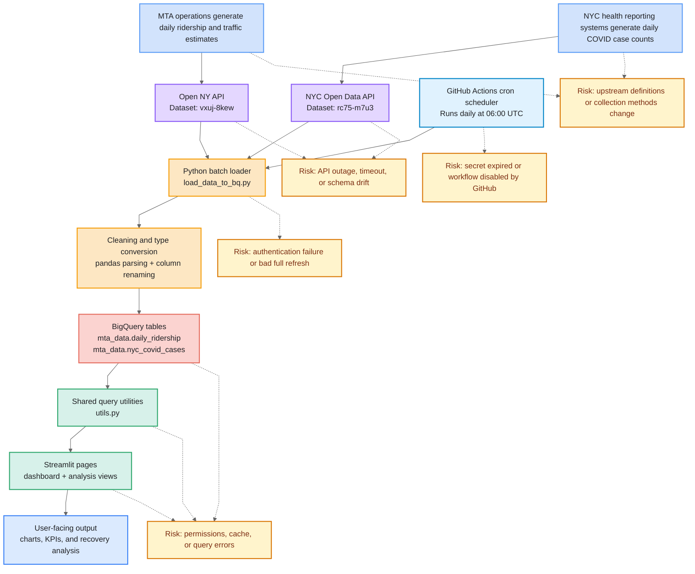

# Lab 11 Data Flow Diagram

Open this file in Markdown Preview to render the Mermaid diagram.

## What Happens

- A GitHub Actions cron job triggers the ETL workflow daily at 06:00 UTC.
- Two upstream organizations generate the source data.
- The workflow pulls both datasets from public JSON APIs.
- `load_data_to_bq.py` authenticates via a GCP service account secret, cleans the data, and fully refreshes two BigQuery tables.
- `utils.py` queries BigQuery and prepares data for the app.
- Streamlit renders charts and analysis for the user.
- The workflow can also be triggered manually via `workflow_dispatch`.

## What Can Go Wrong

- Source definitions or field names may change upstream.
- Public APIs may fail, timeout, or return unexpected schemas.
- A failed batch load can overwrite a previously good table.
- BigQuery permissions, caching, or app queries may fail.
- The GCP service account key stored in GitHub Secrets may expire or be revoked.
- GitHub may automatically disable the scheduled workflow after 60 days of repo inactivity.

If Mermaid Preview is unavailable, use [LAB_11_DIAGRAM.svg](./LAB_11_DIAGRAM.svg) as the screenshot version.
